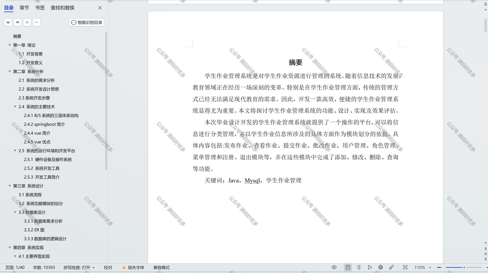

 
## 查看主页获取源码

> **作者介绍**： **✌**全网粉丝10W+本平台特邀作者、博客专家、CSDN新星计划导师、java领域优质创作者,博客之星、掘金/华为云/阿里云/InfoQ等平台优质作者、专注于项目实战 **✌**

  

### 一、作品包含

源码+数据库+设计文档万字+全套环境和工具资源+部署教程

### 二、项目技术

前端技术：Html、Css、Js、Vue、Element-ui

数据库：MySQL

后端技术：Java、Spring Boot、MyBatis

  

### 三、运行环境

开发工具：IDEA/eclipse

数据库：MySQL8.0

数据库管理工具：Navicat10以上版本

环境配置软件： JDK1.8+Maven3.6.3

前端Nodejs：16

  

### 四、项目介绍
项目编号：springbootA023

学生作业管理系统是对学生作业资源进行管理的系统。随着信息技术的发展，教育领域正在经历一场深刻的变革。特别是在学生作业管理方面，传统的管理方式已经无法满足现代教育的需求。因此，开发一款高效、便捷的学生作业管理系统显得尤为重要。本文将探讨学生作业管理系统的功能、设计、实现及效果评估。

本次毕业设计开发的学生作业管理系统就提供了一个操作的平台，可以将信息进行分类管理，并以学生作业信息所涉及的具体方面作为模块划分的依据。具体内容包括:发布作业、查看作业、提交作业、批改作业、用户管理、角色管理、菜单管理和注册、退出模块等，并在这些模块中完成了添加、修改、删除、查询等功能

### 五、运行截图

  
